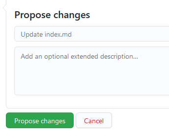

# Get involved

If you notice an inaccuracy, mistake, typo or want to supplement the information in 
this documentation, then you can help us to improve it. All of this documentation is available in the 
public domain on [GitHub]({{ config.repo_url }}).

There are several ways:

1.  [Creating an issue]({{ config.repo_url }}issues/new) with a detailed description of the problem.
1.  [Editing a single page in a browser](#easy-way).
1.  [Manually creating a fork](#second-way) and doing multiply commits before creating a pull request.
1.  [Installing and editing](#hard-way) documentation locally on yours PC.

In each of these cases, a GitHub account is required.
If you don't want to register on GitHub, you can just [contact us](contacts.md) with any convenient way.

### Easy way

On each page in the upper right corner of the text top there is a link with a picture of a pencil :material-pencil:.
After clicking on this link, you will be asked to create a fork of the repository (if you have
not done this before). 

Creating a fork is done with one green button. After that, the edit form with page source code will open.

!!! note "For correct edit of page, please read the [introduction into Mkdocs](#introduction-into-mkdocs)."

After editing the page, you must fill out a description of what you have done.

Submitting a change will write it to a new branch in your fork, so you can send a pull request. 
We will review your pull request and accept it in the main branch.

Thus, this method is only suitable for simple edits on one page.
There is [another way](#second-way) to create pull requests to fix multiple pages at once.

### Second way

This method allows you to make several edits on different pages before proposing them in a pull request.

1.  Create a fork [of the repository]({{ config.repo_url }}) if it has not been created yet.
    (Just click the "Fork" button in the upper right corner.)
1.  Go to the created fork and find the file you are interested in.
1.  Open the file and click the edit button.
1.  Make edits and commit with a clear description of the changes.
1.  Edit other files of interest to you in the same way.
1.  Go to the start page of the fork and click on the "Pull request" button.

### Hard way

This method involves installing the Git, IDE, Python and 
[Material for MkDocs](https://squidfunk.github.io/mkdocs-material) on a local computer.

TODO fill me

## Introduction into Mkdocs

TODO fill me

For full documentation visit https://mkdocs.org and https://squidfunk.github.io/mkdocs-material.